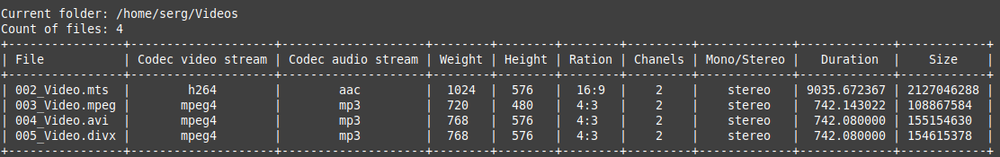

# ffmpeg_convert
Python scripts for the more comfortable work with ffmpeg

There are 2 scripts:
1. ffmpeg_convert.py - for the batch converting files in the current directory

2. ffmpeg_info.py - for get the information about files in the current directory

